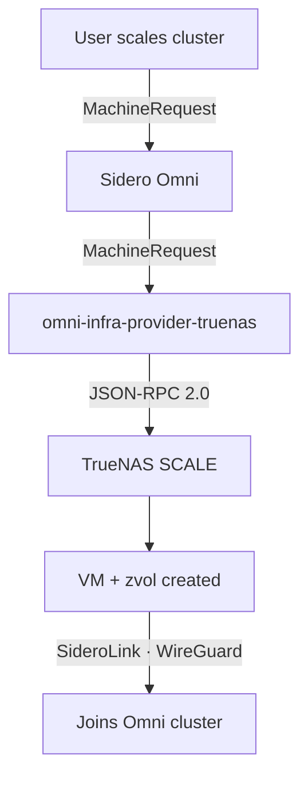
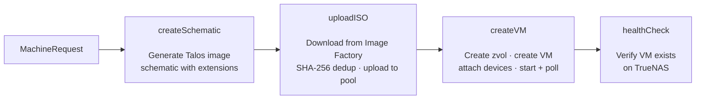

<!-- omni-infra-provider-truenas — TrueNAS SCALE infrastructure provider for Sidero Omni -->
<!-- SPDX-License-Identifier: MIT -->
<!-- keywords: truenas, omni, talos, kubernetes, infrastructure-provider, vm, zfs, json-rpc -->
<!-- category: infrastructure, kubernetes, virtualization -->
<!-- language: go -->

<div align="center">


<br />
<br />

**Automatically provision and manage Talos Linux VMs on TrueNAS SCALE through [Sidero Omni](https://omni.siderolabs.com/).**

[](https://github.com/bearbinary/omni-infra-provider-truenas/actions/workflows/ci.yaml)
[](https://github.com/bearbinary/omni-infra-provider-truenas/actions/workflows/release.yaml)
[](go.mod)
[](LICENSE)
[](https://github.com/bearbinary/omni-infra-provider-truenas/releases/latest)
[](https://ghcr.io/bearbinary/omni-infra-provider-truenas)
[](https://sonarcloud.io/summary/new_code?id=bearbinary_omni-infra-provider-truenas)
[](docs/testing.md)

<br />

[Getting Started](docs/getting-started.md) ·
[Quick Start](#quick-start) ·
[Configuration](#configuration) ·
[Usage](#usage) ·
[Architecture](#architecture) ·
[FAQ](#faq) ·
[AI/LLM Reference](llms.txt)

</div>

<br />

> [!IMPORTANT]
> **Requires TrueNAS SCALE 25.04+ (Fangtooth).** This provider uses the JSON-RPC 2.0 API exclusively. The legacy REST v2.0 API is **not supported**.

> **New to Kubernetes?** Start with the [Getting Started guide](docs/getting-started.md) — a step-by-step tutorial from NAS to running cluster, no prior experience required.

> **Experimental: cluster autoscaling.** The provider ships an `autoscaler` subcommand that wires Kubernetes Cluster Autoscaler to Omni — scale-up only, opt-in per MachineClass. See [`docs/autoscaler.md`](docs/autoscaler.md) for the full operator guide, deploy recipe, and experimental-status caveats.

---

## Overview

**What is omni-infra-provider-truenas?** It is an open-source infrastructure provider that automatically provisions and manages Talos Linux virtual machines on TrueNAS SCALE through [Sidero Omni](https://omni.siderolabs.com/) — turning your NAS into a fully automated Kubernetes platform. It bridges Omni and [TrueNAS SCALE](https://www.truenas.com/truenas-scale/), enabling fully automated Kubernetes cluster provisioning on your own hardware. When Omni requests a machine, this provider creates a Talos Linux VM on TrueNAS — complete with ZFS-backed storage, network configuration, and automatic Omni enrollment.

### Key Features

- **Zero-touch VM lifecycle** — provision, start, stop, and destroy VMs automatically in response to Omni MachineRequests
- **WebSocket JSON-RPC 2.0** — connects to TrueNAS via authenticated WebSocket with API key
- **ZFS-native storage** — zvols for VM disks, automatic ISO caching with SHA-256 deduplication
- **Multi-arch support** — `amd64` and `arm64` VM images via [Talos Image Factory](https://factory.talos.dev/)
- **Flexible networking** — bridges, VLANs, or physical NICs
- **Startup health checks** — validates pool, NIC, and API connectivity before accepting work
- **Persistent storage** — Longhorn-ready with dedicated data disks (`storage_disk_size`). See [storage guide](docs/storage.md)
- **Background cleanup** — automatically removes stale ISOs and orphan VMs/zvols
- **OpenTelemetry observability** — traces, metrics, and profiling (optional)

---

## How It Works



1. **Omni creates a MachineRequest** — user scales a cluster or creates a MachineSet
2. **Provider generates a Talos schematic** — defines the OS image with extensions (e.g., `qemu-guest-agent`)
3. **Provider downloads the Talos ISO** — from [Image Factory](https://factory.talos.dev/), cached on TrueNAS to avoid re-downloading
4. **Provider creates a VM** — zvol for disk, CDROM with ISO, NIC on your bridge, starts the VM
5. **VM boots Talos, joins Omni** — via SideroLink (outbound WireGuard tunnel)

When machines are removed, the provider stops the VM, deletes it, and cleans up the zvol.

---

## Transport

This provider communicates with TrueNAS via **JSON-RPC 2.0 over WebSocket** — the same protocol used by TrueNAS's own CLI (`midclt`) and web UI.

All deployments require `TRUENAS_HOST` and `TRUENAS_API_KEY`. TrueNAS 25.10 removed implicit authentication on the Unix socket, so an API key is required whether the provider runs on the TrueNAS host or elsewhere.

> The legacy REST v2.0 API (`/api/v2.0/`) is **not supported**. TrueNAS deprecated it in 25.04 and will remove it in 26.x.

---

## Quick Start

### Prerequisites

1. **TrueNAS SCALE 25.04+** — the JSON-RPC 2.0 API is required
2. **Omni instance** with an infrastructure provider service account
3. **ZFS pool** with available space
4. **Network interface** for VM traffic — a bridge (e.g., `br0`), VLAN (e.g., `vlan100`), or physical NIC

### Create the Omni Service Account

```bash
omnictl serviceaccount create --role=InfraProvider infra-provider:truenas
# Save the output — it contains OMNI_SERVICE_ACCOUNT_KEY
```

### Option 1: Docker Compose on TrueNAS (Recommended)

Run the container directly on your TrueNAS host via **Apps > Discover > Install via YAML**. Create an API key first — see [TrueNAS Setup > API Key](docs/truenas-setup.md#5-api-key) for the recommended scoped-role setup (dedicated non-root user, minimum 11 roles). Do **not** use the `root` user's API key.

**Available image tags:**

| Tag | Channel | Use when |
|---|---|---|
| `:latest` | Stable | Production / "I want what's been validated" |
| `:0.16` (or `:X.Y`) | Stable, pinned to minor | You want stable but not silent major bumps |
| `:v0.16.0` / `:0.16.0` | Specific version | Pinning to exactly one release |
| `:preview` | Newest published, stable OR pre-release | Soak-cohort / "I want the leading edge to test" |
| `:v0.16.1-rc.5` / `:0.16.1-rc.5` | Specific pre-release | Pinning to a specific RC for validation |

`:latest` is moved by stable releases only. `:preview` is moved by every release — including pre-releases — but only when the new release is the newest in semver order, so a hot-fix on an old branch cannot move `:preview` backward. If no pre-release is newer than the current stable, `:preview` and `:latest` point at the same image.

```yaml
# Paste into TrueNAS Apps > Discover > Install via YAML
services:
  omni-infra-provider-truenas:
    image: ghcr.io/bearbinary/omni-infra-provider-truenas:latest
    restart: unless-stopped
    network_mode: host
    environment:
      OMNI_ENDPOINT: "https://omni.example.com"
      OMNI_SERVICE_ACCOUNT_KEY: "<your-key>"
      TRUENAS_HOST: "localhost"
      TRUENAS_API_KEY: "<your-truenas-api-key>"
      TRUENAS_INSECURE_SKIP_VERIFY: "true"
      DEFAULT_POOL: "default"
      DEFAULT_NETWORK_INTERFACE: "br0"
```

### Option 2: Kubernetes (Helm)

```bash
helm install omni-infra-provider deploy/helm/omni-infra-provider-truenas \
  --namespace omni-infra-provider --create-namespace \
  --set omniEndpoint="https://omni.example.com" \
  --set truenasHost="truenas.local" \
  --set secrets.omniServiceAccountKey="<your-key>" \
  --set secrets.truenasApiKey="<your-api-key>" \
  --set defaults.pool="default"
```

See [`deploy/helm/`](deploy/helm/omni-infra-provider-truenas/) for the chart and `values.yaml`.

### Option 3: Docker Compose (Remote)

For running on a separate host via WebSocket:

```bash
cp .env.example .env
# Fill in OMNI_ENDPOINT, OMNI_SERVICE_ACCOUNT_KEY, TRUENAS_HOST, TRUENAS_API_KEY
docker compose -f deploy/docker-compose.yaml up -d
```

---

## Configuration

All configuration is via environment variables. A `.env` file is loaded automatically if present.

### Required

| Variable | Description |
|---|---|
| `OMNI_ENDPOINT` | Omni instance URL (e.g., `https://omni.example.com`) |
| `OMNI_SERVICE_ACCOUNT_KEY` | Omni infra provider service account key |

### TrueNAS Connection

| Variable | Default | Description |
|---|---|---|
| `TRUENAS_HOST` | — | **Required.** TrueNAS hostname or IP (e.g., `truenas.local`, or `localhost` when running the container on the TrueNAS host itself) |
| `TRUENAS_API_KEY` | — | **Required.** TrueNAS API key — create a dedicated non-root user with scoped roles ([setup](docs/truenas-setup.md#5-api-key)). Do not use the `root` user's key. |
| `TRUENAS_INSECURE_SKIP_VERIFY` | `false` | Skip TLS verification for self-signed certs |

### Provider Defaults

| Variable | Default | Description |
|---|---|---|
| `DEFAULT_POOL` | `default` | ZFS pool for VM zvols and ISO cache |
| `DEFAULT_NETWORK_INTERFACE` | — | Network interface for VM NICs (bridge, VLAN, or physical) |
| `DEFAULT_BOOT_METHOD` | `UEFI` | VM boot method (`UEFI` or `BIOS`) |
| `CONCURRENCY` | `4` | Max parallel provision/deprovision workers |
| `LOG_LEVEL` | `info` | Log level: `debug`, `info`, `warn`, `error` |
| `TRUENAS_MAX_CONCURRENT_CALLS` | `8` | Max concurrent JSON-RPC calls to TrueNAS |
| `GRACEFUL_SHUTDOWN_TIMEOUT` | `30` | Seconds to wait for ACPI shutdown before force-stop on deprovision |
| `MAX_ERROR_RECOVERIES` | `5` | Max consecutive ERROR recoveries before auto-replacing a VM (`-1` to disable) |
| `HEALTH_LISTEN_ADDR` | `:8081` | Address for the HTTP health endpoint (`/healthz`, `/readyz`) |

### Provider Identity (Optional)

| Variable | Default | Description |
|---|---|---|
| `PROVIDER_ID` | `truenas` | Provider ID registered with Omni |
| `PROVIDER_NAME` | `TrueNAS` | Display name in Omni UI |
| `PROVIDER_DESCRIPTION` | `TrueNAS SCALE infrastructure provider` | Description in Omni UI |
| `OMNI_INSECURE_SKIP_VERIFY` | `false` | Skip TLS verification for Omni connection |

### Singleton Enforcement (Optional)

Prevents two processes with the same `PROVIDER_ID` from racing on VM/zvol/ISO
operations. On by default; see [`docs/architecture.md`](docs/architecture.md#singleton-enforcement)
and [`docs/troubleshooting.md`](docs/troubleshooting.md#singleton-lease-acquire-failed--another-provider-instance-holds-the-singleton-lease).

| Variable | Default | Description |
|---|---|---|
| `PROVIDER_SINGLETON_ENABLED` | `true` | Claim a distributed lease on startup; fail fast if another instance holds it |
| `PROVIDER_SINGLETON_REFRESH_INTERVAL` | `15s` | How often to refresh the lease heartbeat |
| `PROVIDER_SINGLETON_STALE_AFTER` | `45s` | Heartbeat age at which another instance may take over (must be `>= 2x` refresh) |

### Observability (Optional)

| Variable | Description |
|---|---|
| `OTEL_EXPORTER_OTLP_ENDPOINT` | OpenTelemetry collector endpoint (e.g., `localhost:4317`) |
| `OTEL_EXPORTER_OTLP_INSECURE` | Use insecure gRPC to collector |
| `OTEL_SERVICE_NAME` | Override service name (default: `omni-infra-provider-truenas`) |
| `PYROSCOPE_URL` | Pyroscope endpoint for continuous profiling (e.g., `http://localhost:4040`) |

See [`deploy/observability/`](deploy/observability/) for a ready-to-use Prometheus + Tempo + Grafana stack.

### ISO Handling

Talos ISOs are downloaded automatically from [Image Factory](https://factory.talos.dev/) based on the schematic generated for each machine request. ISOs are cached on the TrueNAS filesystem at `<pool>/talos-iso/` and deduplicated by SHA-256 hash — the same image is never downloaded twice.

---

## Usage

Once the provider is running and connected to Omni, create MachineClasses to trigger VM provisioning.

### Via omnictl (CLI)

**Create a MachineClass:**

```bash
cat <<'EOF' | omnictl apply -f -
metadata:
  namespace: default
  type: MachineClasses.omni.sidero.dev
  id: truenas-small
spec:
  autoprovision:
    providerid: truenas
    grpcendpoint: ""
    icon: ""
    configpatch: |
      cpus: 2
      memory: 4096
      disk_size: 40
EOF
```

**With custom pool and NIC (overrides provider defaults):**

```bash
cat <<'EOF' | omnictl apply -f -
metadata:
  namespace: default
  type: MachineClasses.omni.sidero.dev
  id: truenas-large
spec:
  autoprovision:
    providerid: truenas
    grpcendpoint: ""
    icon: ""
    configpatch: |
      cpus: 8
      memory: 16384
      disk_size: 200
      pool: "fast-nvme"
      network_interface: "vlan100"
EOF
```

Assign the MachineClass when creating a cluster or MachineSet in Omni.

**Multi-pool setup (e.g., NVMe for control plane, HDD for workers):**

Create separate MachineClasses targeting different ZFS pools. Each VM's zvol and ISO cache are created on the specified pool.

```bash
# Control plane on fast NVMe pool
cat <<'EOF' | omnictl apply -f -
metadata:
  namespace: default
  type: MachineClasses.omni.sidero.dev
  id: truenas-cp-nvme
spec:
  autoprovision:
    providerid: truenas
    grpcendpoint: ""
    icon: ""
    configpatch: |
      cpus: 2
      memory: 2048
      disk_size: 10
      pool: "fast-nvme"
EOF

# Workers on bulk HDD pool (with storage disk for Longhorn)
cat <<'EOF' | omnictl apply -f -
metadata:
  namespace: default
  type: MachineClasses.omni.sidero.dev
  id: truenas-worker-hdd
spec:
  autoprovision:
    providerid: truenas
    grpcendpoint: ""
    icon: ""
    configpatch: |
      cpus: 4
      memory: 8192
      disk_size: 100
      pool: "bulk-hdd"
      storage_disk_size: 100
EOF
```

To move a VM to a different pool, update the `pool` field in its MachineClass and let Omni deprovision/reprovision — Talos nodes are stateless, so this is safe and automatic.

### Via Omni Web UI

1. Navigate to **Clusters > Create Cluster** (or edit an existing cluster)
2. In the machine selection step, choose **Auto Provision** and select the `truenas` provider
3. Configure CPUs, Memory, Disk Size, and optional overrides
4. Set the desired replica count and create the cluster

Fields left blank use the provider's defaults (`DEFAULT_POOL`, `DEFAULT_NETWORK_INTERFACE`, etc.).

### MachineClass Config Reference

These fields go in the MachineClass `configpatch` (CLI) or the provider config form (UI):

| Field | Type | Required | Default | Description |
|---|---|---|---|---|
| `cpus` | int | Yes | `2` | Virtual CPUs (min: 1) |
| `memory` | int | Yes | `4096` | Memory in MiB (min: 1024) |
| `disk_size` | int | Yes | `40` | Root disk in GiB (min: 20 — needed for Talos + CP container images during bootstrap; see [sizing guide](docs/sizing.md#why-the-root-disk-has-a-20-gib-minimum)) |
| `pool` | string | Yes | — | ZFS **pool** name (top-level only — not a dataset path, see below) |
| `network_interface` | string | Yes | — | Bridge, VLAN, or physical interface for VM NIC |
| `boot_method` | string | Yes | `UEFI` | `UEFI` or `BIOS` |
| `architecture` | string | Yes | `amd64` | `amd64` or `arm64` |
| `dataset_prefix` | string | No | — | Dataset path under pool for isolation (see below) |
| `advertised_subnets` | string | No | — | Comma-separated CIDRs to pin etcd/kubelet (required for multi-NIC) |
| `encrypted` | bool | No | `false` | Enable ZFS AES-256-GCM encryption (passphrase auto-generated per zvol) |
| `extensions` | list | No | — | Additional Talos extensions (merged with defaults) |
| `additional_disks` | list | No | — | Extra data disks beyond root (each: `size` required, optional `pool`, `dataset_prefix`, `encrypted`) |
| `additional_nics` | list | No | — | Extra NICs for network segmentation (each: `network_interface` required, optional `type`, `mtu`) |
| `storage_disk_size` | int | No | — | Dedicated data disk (GiB) for Longhorn persistent storage |

#### Understanding `pool` vs `dataset_prefix`

ZFS has a hierarchy: **pools** contain **datasets**, which contain **zvols** (virtual disks). The provider needs to know both where your storage lives:

- **`pool`** — The **top-level ZFS pool name** only (e.g., `default`, `tank`, `fast-nvme`). This is NOT a dataset path. Run `zpool list` or check TrueNAS UI under **Storage** to see your pool names.
- **`dataset_prefix`** — An optional **dataset path within the pool** where the provider should create VM storage. Use this when you want VMs organized under an existing dataset hierarchy.

The provider creates zvols at `<pool>/<dataset_prefix>/omni-vms/<vm-id>` and caches ISOs at `<pool>/<dataset_prefix>/talos-iso/`.

**Example:** If your ZFS layout looks like this:

```
default                    ← pool
  └── previewk8            ← dataset (created by you)
        └── previewcluster ← zvol (existing VM disk)
```

The correct MachineClass config is:

```yaml
pool: "default"              # The pool name — NOT "previewk8" or "default/previewk8"
dataset_prefix: "previewk8"  # The dataset path under the pool
```

This creates VMs at `default/previewk8/omni-vms/...` — right alongside your existing `previewcluster` zvol.

**Common mistake:** Setting `pool: "previewk8"` or `pool: "default/previewk8"` — both will fail with "pool not found" because `previewk8` is a dataset inside the `default` pool, not a pool itself.

| Your ZFS layout | `pool` | `dataset_prefix` | VMs created at |
|---|---|---|---|
| `tank` (flat) | `tank` | _(empty)_ | `tank/omni-vms/...` |
| `default/myproject` | `default` | `myproject` | `default/myproject/omni-vms/...` |
| `default/prod/k8s` | `default` | `prod/k8s` | `default/prod/k8s/omni-vms/...` |
| `fast-nvme` (separate pool) | `fast-nvme` | _(empty)_ | `fast-nvme/omni-vms/...` |

### Recommended MachineClasses

| Class | CPUs | Memory | Disk | Use Case |
|---|---|---|---|---|
| `truenas-control-plane` | 2 | 2048 MiB | 10 GiB | Control plane (etcd + API server) |
| `truenas-worker` | 4 | 8192 MiB | 100 GiB | Workers (application workloads) |

> **Note:** Talos requires a minimum of 2 GiB RAM for control plane nodes. Control plane disks only need ~10 GiB (OS + etcd). Workers need more disk for container images.

### Talos System Extensions

Every VM automatically includes these extensions:

- `siderolabs/qemu-guest-agent` — hypervisor-to-guest communication
- `siderolabs/util-linux-tools` — mount/block device operations
- `siderolabs/iscsi-tools` — iSCSI initiator (required by Longhorn; also used by democratic-csi iSCSI mode)

If you need NFS client support (for democratic-csi NFS mode or manual NFS mounts), add `siderolabs/nfs-utils` to your MachineClass `extensions` field.

Add more via the `extensions` field in MachineClass config:

```yaml
extensions:
  - "siderolabs/iscsi-tools"
```

---

## Architecture

```
cmd/omni-infra-provider-truenas/
├── main.go                     # Entry point, env config, transport auto-detection
└── data/
    ├── schema.json             # MachineClass config schema (served to Omni UI)
    └── icon.svg                # Provider icon for Omni UI

internal/
├── client/                     # TrueNAS JSON-RPC 2.0 client
│   ├── transport.go            # Transport interface
│   ├── ws.go                   # WebSocket transport (JSON-RPC 2.0, API key auth)
│   ├── truenas.go              # Client constructor
│   ├── vm.go                   # VM CRUD operations
│   ├── device.go               # Device attachment (CDROM, DISK, NIC)
│   ├── storage.go              # ZFS storage operations (zvols, ISOs)
│   └── jsonrpc.go              # JSON-RPC 2.0 protocol implementation
├── provisioner/
│   ├── provisioner.go          # Provisioner struct, infra.Provisioner interface
│   ├── steps.go                # 4 provision steps (schematic → ISO → VM → health)
│   ├── deprovision.go          # VM teardown and cleanup
│   └── data.go                 # MachineClass config parsing + validation
├── singleton/
│   └── singleton.go            # Distributed lease preventing duplicate instances
├── cleanup/
│   └── cleanup.go              # Background stale ISO / orphan VM cleanup
├── health/
│   └── health.go               # HTTP health endpoint (/healthz, /readyz)
├── monitor/
│   └── monitor.go              # Host health monitoring (OTEL gauges)
├── resources/
│   ├── machine.go              # COSI Machine typed resource
│   └── meta/meta.go            # Provider ID constant
└── telemetry/
    ├── telemetry.go            # OpenTelemetry + Pyroscope init
    └── metrics.go              # Custom metrics

deploy/
├── docker-compose.yaml         # Docker Compose for remote deployment
├── helm/                       # Helm chart
└── observability/              # Prometheus + Tempo + Grafana stack

api/specs/
├── specs.proto                 # Protobuf definition for Machine resource
└── specs.pb.go                 # Generated Go code
```

### Provision Flow



---

## Supply Chain Security

All Docker images are signed with [cosign](https://docs.sigstore.dev/cosign/overview/) (keyless, via Sigstore). Every release includes an SBOM (SPDX) and binary signatures.

### Verify Docker Image

```bash
cosign verify --certificate-identity-regexp="https://github.com/bearbinary/omni-infra-provider-truenas" --certificate-oidc-issuer="https://token.actions.githubusercontent.com" ghcr.io/bearbinary/omni-infra-provider-truenas:v0.13.0
```

### Verify Binary

Releases from v0.16.2 onward sign each binary as a single sigstore bundle
(`<binary>.sigstore.json`) instead of the legacy `.sig` + `.cert` pair. The
verification command differs:

```bash
# v0.16.2 and later (sigstore bundle):
cosign verify-blob --bundle omni-infra-provider-truenas-linux-amd64.sigstore.json --certificate-identity-regexp="https://github.com/bearbinary/omni-infra-provider-truenas" --certificate-oidc-issuer="https://token.actions.githubusercontent.com" omni-infra-provider-truenas-linux-amd64

# v0.16.1 and earlier (legacy .sig + .cert):
cosign verify-blob --certificate omni-infra-provider-truenas-linux-amd64.cert --signature omni-infra-provider-truenas-linux-amd64.sig --certificate-identity-regexp="https://github.com/bearbinary/omni-infra-provider-truenas" --certificate-oidc-issuer="https://token.actions.githubusercontent.com" omni-infra-provider-truenas-linux-amd64
```

### View SBOM

Download `sbom.spdx.json` from the [release assets](https://github.com/bearbinary/omni-infra-provider-truenas/releases/latest).

---

## Grafana Dashboards

Four ready-to-import Grafana dashboards ship with each release. They cover VM health, provisioning latency, TrueNAS API performance, and cleanup metrics.

### Quick install (recommended)

Download the dashboard bundle from the latest release and import via the Grafana UI:

```bash
curl -L https://github.com/bearbinary/omni-infra-provider-truenas/releases/latest/download/grafana-dashboards.zip -o dashboards.zip
unzip dashboards.zip -d dashboards/
```

Then in Grafana: **Dashboards → New → Import → Upload JSON file**. When prompted, select your Prometheus, Tempo, Loki, and Pyroscope data sources.

### Import from grafana.com

Once approved on [grafana.com/dashboards](https://grafana.com/grafana/dashboards/), you can import by ID from **Dashboards → New → Import → Paste ID**.

| Dashboard | ID | Description |
|---|---|---|
| Omni TrueNAS Provider — Overview | _pending_ | VM count, host health, pool status, and provisioning rate |
| Omni TrueNAS Provider — VM Provisioning | _pending_ | Per-step provision/deprovision latency, error categories, ISO cache hits |
| Omni TrueNAS Provider — TrueNAS API Performance | _pending_ | JSON-RPC call latency by method, WebSocket reconnects, rate limit queue depth |
| Omni TrueNAS Provider — Cleanup & Maintenance | _pending_ | Stale ISO cleanup, orphan VM detection, zvol reclaim metrics |

### Local dev stack

Run `docker compose -f deploy/observability/docker-compose.yaml up -d` to start Prometheus, Tempo, Loki, Pyroscope, and Grafana locally. Dashboards are autoloaded at [localhost:3000](http://localhost:3000).

---

## Development

```bash
make build              # Build binary to _out/
make test               # Run unit tests
make test-v             # Verbose unit tests
make test-integration   # Integration tests (requires TrueNAS instance)
make test-e2e           # Full E2E tests (requires TrueNAS instance)
make lint               # Run linters
make image              # Build Docker image
make generate           # Regenerate protobuf from specs.proto
```

Integration and E2E tests require a real TrueNAS SCALE instance. See [`docs/testing.md`](docs/testing.md) for setup instructions.

For detailed system design, see [`docs/architecture.md`](docs/architecture.md). For networking (bridges, DHCP, MetalLB, VIP, UniFi), see [`docs/networking.md`](docs/networking.md). For persistent storage (Longhorn setup), see [`docs/storage.md`](docs/storage.md). For common issues, see [`docs/troubleshooting.md`](docs/troubleshooting.md). For version upgrades, see [`docs/upgrading.md`](docs/upgrading.md).

### Binary Releases

Multi-platform binaries are built automatically on every release:

- `linux/amd64`, `linux/arm64`
- `darwin/amd64`, `darwin/arm64`

Docker images are published to `ghcr.io/bearbinary/omni-infra-provider-truenas` with multi-arch support.

---

## FAQ

<details>
<summary><strong>Does Omni cost money?</strong></summary>

Omni has a free tier for personal/homelab use. Check [omni.siderolabs.com](https://omni.siderolabs.com/) for current pricing. You can also self-host Omni.
</details>

<details>
<summary><strong>Will this affect my NAS performance?</strong></summary>

Yes — VMs share your NAS hardware (CPU, RAM, disk). Start small and monitor. You can remove VMs anytime if things slow down.
</details>

<details>
<summary><strong>How much disk space do the VMs use?</strong></summary>

Talos ISO: ~100 MB (cached once). Control plane: ~10 GB each. Worker: 40-100 GB each. All ZFS-compressed — actual usage is often less.
</details>

<details>
<summary><strong>Can I use this without internet?</strong></summary>

No. VMs need outbound HTTPS for Talos ISO download (first time, then cached) and SideroLink (WireGuard on port 443) to Omni. No inbound ports required.
</details>

<details>
<summary><strong>Can I SSH into the Kubernetes nodes?</strong></summary>

No. Talos Linux has no SSH by design. Manage nodes through `kubectl`, `talosctl`, and the Omni UI.
</details>

<details>
<summary><strong>What if my NAS reboots?</strong></summary>

VMs restart with TrueNAS. The provider auto-recovers and reconnects to Omni. Kubernetes restarts your workloads automatically.
</details>

<details>
<summary><strong>What's the minimum hardware?</strong></summary>

A 1-node cluster needs ~4 cores, 16 GB RAM, and 50 GB free disk (including what TrueNAS uses). See the [Getting Started guide](docs/getting-started.md#hardware-requirements) for full sizing.
</details>

For more questions, see the [Getting Started FAQ](docs/getting-started.md#faq).

---

## Related Projects

- [Sidero Omni](https://github.com/siderolabs/omni) — SaaS Kubernetes management platform
- [Talos Linux](https://github.com/siderolabs/talos) — Immutable Kubernetes OS
- [TrueNAS SCALE](https://github.com/truenas/middleware) — Open-source storage and virtualization platform

---

## Contributing

We use an **issues-only** contribution model — no pull requests. Open an issue describing what you'd like, and optionally prototype in a fork. See [CONTRIBUTING.md](CONTRIBUTING.md) for details.

## License

MIT — see [LICENSE](LICENSE).

Built by [Bear Binary](https://github.com/bearbinary).
