# Observability Blueprint

A drop-in playbook for adding **logs, metrics, traces, and continuous profiles**
to a new Go service, derived from `omni-infra-provider-truenas`. Every section
is paired with the file it maps to in this repo so a reader can lift code as
well as guidance.

The blueprint is opinionated:

- One init path (`telemetry.Init`) that produces a single `shutdown(ctx)` and
  is **fully opt-in** — when no OTLP endpoint is set, the SDK is never
  constructed and the program has zero observability overhead.
- OpenTelemetry SDK for traces / metrics / logs; **Grafana Pyroscope** for
  continuous profiling; **Zap** as the application logger, bridged to OTLP
  via `otelzap` so logs carry `trace_id` / `span_id` and can be jumped to
  from a span.
- Local dev stack and Grafana Cloud are the same code path — only env vars
  differ.

```mermaid
flowchart LR
    App[Go service]
    App -- "logs (zap + otelzap)" --> Coll[OTEL Collector]
    App -- "metrics (OTLP)" --> Coll
    App -- "traces (OTLP)" --> Coll
    App -- "profiles (HTTP)" --> Pyro[Pyroscope]
    Coll --> Loki
    Coll --> Prom[Prometheus]
    Coll --> Tempo
    Loki --> Graf[Grafana]
    Prom --> Graf
    Tempo --> Graf
    Pyro --> Graf
```



---

## 1. Package layout

Adopt this shape in any new service. Names are not magical — the structure is.

```
internal/telemetry/
    telemetry.go             # Init + exporter wiring (OTEL + Pyroscope)
    metrics.go               # instrument registry + label-helper funcs + error-category consts
    histogram_buckets_test.go # regression test: bucket units match recorded units
cmd/<svc>/main.go            # builds zap, calls telemetry.Init, wires otelzap bridge
deploy/observability/        # docker-compose stack + Grafana provisioning
```

Reference: `internal/telemetry/telemetry.go`, `internal/telemetry/metrics.go`,
`cmd/omni-infra-provider-truenas/main.go`.

---

## 2. `telemetry.Init` contract

A single `Config` struct, a single shutdown func. No globals exported from the
package other than the metric instruments. Three properties matter:

1. **Opt-in.** When `OTELEndpoint == ""` and `PyroscopeURL == ""`, the function
   returns a noop shutdown immediately. No SDK is initialized.
2. **Resource attributes are set once.** Service name and version flow into a
   `resource.Resource` shared by trace / metric / log providers. Build with
   `-ldflags "-X main.version=vX.Y.Z"` so production telemetry is correlated to
   a release.
3. **Shutdown joins all errors.** Each subsystem (trace provider, metric
   provider, log provider, pyroscope) appends its `Shutdown` to a slice; the
   returned function calls every one and joins errors with `errors.Join`. Do
   not short-circuit on the first failure — partial flush still beats no flush.

```go
shutdown, err := telemetry.Init(ctx, telemetry.Config{
    OTELEndpoint:    os.Getenv("OTEL_EXPORTER_OTLP_ENDPOINT"),
    OTELProtocol:    envString("OTEL_EXPORTER_OTLP_PROTOCOL", "grpc"),
    OTELInsecure:    envBool("OTEL_EXPORTER_OTLP_INSECURE", true),
    OTELHeaders:     parseHeaders(consumeSecretEnv("OTEL_EXPORTER_OTLP_HEADERS")),
    PyroscopeURL:    os.Getenv("PYROSCOPE_URL"),
    PyroscopeUser:   os.Getenv("PYROSCOPE_BASIC_AUTH_USER"),
    PyroscopePass:   consumeSecretEnv("PYROSCOPE_BASIC_AUTH_PASSWORD"),
    PyroscopeLogger: zapPyroscopeLogger{l: logger.Named("pyroscope")},
    ServiceName:     envString("OTEL_SERVICE_NAME", "<service-name>"),
    ServiceVersion:  version,
})
if err != nil { return err }
defer func() { _ = shutdown(ctx) }()
```

### Two transport variants

Support both `grpc` and `http/protobuf`. Grafana Cloud serves OTLP over HTTPS
under a base URL like `https://otlp-gateway.../otlp`; local dev uses gRPC at
`localhost:4317`.

The HTTP transport has a footgun: `otlptracehttp.WithEndpointURL` treats its
input as the **full per-signal URL** (it follows the per-signal env-var
semantic, not the base-URL semantic). If you pass the Grafana Cloud base URL
verbatim, you get 404s. Append `/v1/traces`, `/v1/metrics`, `/v1/logs`
yourself — see `signalEndpoint()` in `telemetry.go`.

---

## 3. Logging — Zap + OTLP bridge

### Build a zap logger first

```go
loggerConfig := zap.NewProductionConfig()
switch os.Getenv("LOG_LEVEL") {
case "debug": loggerConfig.Level.SetLevel(zap.DebugLevel)
case "warn":  loggerConfig.Level.SetLevel(zap.WarnLevel)
case "error": loggerConfig.Level.SetLevel(zap.ErrorLevel)
default:      loggerConfig.Level.SetLevel(zap.InfoLevel)
}
logger, err := loggerConfig.Build(zap.AddStacktrace(zapcore.ErrorLevel))
```

### Tee to OTLP after telemetry.Init

```go
if os.Getenv("OTEL_EXPORTER_OTLP_ENDPOINT") != "" {
    otelCore := otelzap.NewCore("<service-name>")
    logger = logger.WithOptions(zap.WrapCore(func(core zapcore.Core) zapcore.Core {
        return zapcore.NewTee(core, otelCore)
    }))
}
```

This single block is what makes `Trace → Logs` work in Grafana: every log
record emitted inside an active span carries the `trace_id` / `span_id`
automatically. The Loki datasource in `deploy/observability/grafana-datasources.yaml`
exposes the inverse jump (`Logs → Trace`) by extracting `trace_id=` from log
lines with a derived field.

### Log field hygiene

- Never log secrets. Treat API keys, service-account JWTs, basic-auth tokens
  as `SecretString`-wrapped values and log derived facts (`transport`,
  `tls_verify`) instead of the secret itself.
- Hostnames identifying internal infrastructure should drop to `Debug` so a
  shared multi-tenant log sink can't be used for recon.

---

## 4. Metrics — instrument registry + naming discipline

### One registry file

`internal/telemetry/metrics.go` declares every counter / gauge / histogram as
a package-level `var`. `initMetrics()` populates them once via
`otel.Meter("<service-name>")` after the meter provider is installed. Code
sites import the package and use the variable directly:

```go
telemetry.VMsProvisioned.Add(ctx, 1, telemetry.WithPool(pool))
telemetry.ProvisionDuration.Record(ctx, dur.Seconds(), telemetry.WithStep("createVM"))
```

This pattern has two payoffs:

- **Discoverability.** A new contributor finds every metric the service emits
  by reading one file.
- **No metric typos.** A `meter.Int64Counter("foo.bar.baz")` call buried in
  a handler is a string literal; a `telemetry.VMsProvisioned` reference is a
  compile error if misspelled.

### Naming and units

- Dot-separated hierarchy under a service prefix: `truenas.vms.provisioned`,
  `truenas.api.duration`. Pick a prefix and never deviate.
- Set `metric.WithUnit("s")` / `"By"` on every histogram and byte counter.
  Grafana reads the unit from the metric descriptor.
- **Set explicit histogram bucket boundaries that match the unit you record
  in.** The OTEL SDK default boundaries are
  `[0, 5, 10, 25, 50, 75, 100, 250, 500, 750, 1000, 2500, 5000, 7500, 10000]`
  — these look like milliseconds. If you record seconds into a histogram with
  the default boundaries, every call under 5 s collapses into the first
  populated bucket and `histogram_quantile()` returns ~2.5 s p50 (≈250×
  inflated) for sub-second durations. This bug shipped in this repo as
  v0.15.0. The regression test `TestHistogramBuckets_MatchRecordedUnit` in
  `histogram_buckets_test.go` rejects any duration histogram whose boundaries
  combine values ≥1000 with sub-1 values — copy that test.

### Label cardinality

Use coarse labels only: `method`, `step`, `error_category`, `pool`,
`patch_kind`. Never label by user ID, request ID, hostname, or anything
unbounded. Prometheus active series cost is linear in cardinality.

Centralize label *values* that span Go + Grafana JSON + alert rules. The
`ErrCategory*` constants in `metrics.go` are the canonical names of the
buckets `truenas.provision.errors` filters on — renaming a category is one
edit, not a grep across three repos.

### Helper functions for common labels

```go
func WithMethod(method string) metric.MeasurementOption { ... }
func WithStep(step string) metric.MeasurementOption     { ... }
func WithErrorCategory(c string) metric.MeasurementOption { ... }
```

Saves call sites from re-writing `metric.WithAttributes(attribute.String(...))`
every time.

---

## 5. Tracing

The same `telemetry.Init` call installs the global `TracerProvider`. Code that
needs a span calls `otel.Tracer("<component>").Start(ctx, "operation")`. The
otelzap bridge guarantees logs inside the span carry the trace id.

For HTTP / gRPC handlers, use the relevant `otelhttp` / `otelgrpc`
instrumentation — that part is outside this blueprint.

Console export (`OTEL_CONSOLE_EXPORT=true`) tees traces/metrics/logs to
stdout. Verbose; opt-in only for local debugging.

---

## 6. Profiling — Pyroscope

```go
profiler, err := pyroscope.Start(pyroscope.Config{
    ApplicationName:   cfg.ServiceName,
    ServerAddress:     cfg.PyroscopeURL,
    BasicAuthUser:     cfg.PyroscopeUser,
    BasicAuthPassword: cfg.PyroscopePass,
    Logger:            logger, // never leave this nil — see below
    Tags:              map[string]string{"version": cfg.ServiceVersion},
    ProfileTypes: []pyroscope.ProfileType{
        pyroscope.ProfileCPU,
        pyroscope.ProfileAllocObjects,
        pyroscope.ProfileAllocSpace,
        pyroscope.ProfileInuseObjects,
        pyroscope.ProfileInuseSpace,
        pyroscope.ProfileGoroutines,
    },
})
runtime.SetMutexProfileFraction(5)
runtime.SetBlockProfileRate(5)
```

Two pieces of hard-won advice baked into `telemetry.go`:

- **Always pass a `Logger`.** `pyroscope-go`'s default logger is a no-op. A
  401, connection refused, or DNS failure on the upload path is swallowed
  silently — the symptom is "no profiles in Pyroscope" with no clue where to
  look. Adapt your application logger (see `zapPyroscopeLogger` in
  `cmd/omni-infra-provider-truenas/main.go`) or fall back to the
  `stderrPyroscopeLogger` shipped in this repo.
- **Tag with version.** `version=<service-version>` lets the Pyroscope UI
  diff CPU/heap profiles across releases.

Grafana wires profiles to traces via the Tempo datasource's
`tracesToProfiles` block (`profileTypeId:
"process_cpu:cpu:nanoseconds:cpu:nanoseconds"`) — see
`grafana-datasources.yaml`.

---

## 7. Environment-variable contract

| Variable                              | Purpose                                                                  |
| ------------------------------------- | ------------------------------------------------------------------------ |
| `LOG_LEVEL`                           | `debug` / `info` / `warn` / `error`. Default `info`.                     |
| `OTEL_EXPORTER_OTLP_ENDPOINT`         | `host:4317` (gRPC) or `https://.../otlp` (HTTP). Empty disables OTLP.    |
| `OTEL_EXPORTER_OTLP_PROTOCOL`         | `grpc` (default) or `http/protobuf`.                                     |
| `OTEL_EXPORTER_OTLP_INSECURE`         | `true` for local, `false` for Grafana Cloud.                             |
| `OTEL_EXPORTER_OTLP_HEADERS`          | `key=value,key2=value2`. Carries Grafana Cloud `Authorization`.          |
| `OTEL_SERVICE_NAME`                   | `service.name` resource attribute.                                       |
| `OTEL_CONSOLE_EXPORT`                 | `true` to also emit telemetry to stdout (verbose).                       |
| `PYROSCOPE_URL`                       | Pyroscope server. Empty disables profiling.                              |
| `PYROSCOPE_BASIC_AUTH_USER`           | Instance ID (Grafana Cloud).                                             |
| `PYROSCOPE_BASIC_AUTH_PASSWORD`       | API token. Consumed-and-unset on startup.                                |

### Secret env-var hygiene

`consumeSecretEnv(name)` reads the variable, immediately calls
`os.Unsetenv`, and returns the captured value. Once secrets are captured,
`/proc/<pid>/environ`, core-dump readers, and child-process inheritance can
no longer recover them. Always wrap secret reads with this pattern *before*
passing the value into `telemetry.Init` or any other constructor.

---

## 8. Local dev stack

`deploy/observability/docker-compose.yaml` brings up the full pipeline:

| Service          | Purpose                                            | Default port |
| ---------------- | -------------------------------------------------- | ------------ |
| `otel-collector` | OTLP receiver, fanout to backends                  | `4317`       |
| `tempo`          | Trace backend                                      | `3200`       |
| `loki`           | Log backend                                        | `3100`       |
| `prometheus`     | Metric backend + alert rules                       | `9090`       |
| `pyroscope`      | Profile backend                                    | `4040`       |
| `grafana`        | UI, auto-loads datasources + dashboards            | `3000`       |

Run with:

```sh
docker compose -f deploy/observability/docker-compose.yaml up -d
OTEL_EXPORTER_OTLP_ENDPOINT=localhost:4317 \
PYROSCOPE_URL=http://localhost:4040 \
./<binary>
```

Every port is overridable via env (`GRAFANA_PORT`, `OTEL_PORT`, …) for
machines where 3000 / 9090 are taken.

### Grafana provisioning

Datasources, dashboards, and the dashboards folder are all provisioned at
container start — there is **no manual click-through setup**. Adopt the same
shape:

- `grafana-datasources.yaml` → declares Prometheus / Tempo / Loki / Pyroscope
  with the cross-links between them (Tempo → Loki, Loki → Tempo, Tempo →
  Pyroscope, Prometheus exemplars → Tempo).
- `grafana-dashboards.yaml` → declares the dashboard provider that auto-loads
  every JSON file under `dashboards/`.

The cross-links are the high-value part. Without `tracesToLogsV2`, a span
view doesn't open the matching log lines. Without the Loki `derivedFields`
regex extracting `trace_id=(\w+)`, a log line doesn't open the matching
trace. Without `tracesToProfiles`, you can't go from a slow span to the CPU
profile that was captured during it.

---

## 9. Required regression tests

Two tests have caught real bugs and are worth porting:

1. **Bucket-boundary unit test** (`TestHistogramBuckets_MatchRecordedUnit`).
   Records a known small duration into every duration histogram and asserts
   the boundaries are in the same unit. Catches "shipped with default
   millisecond boundaries while recording seconds."
2. **Dev-version-with-OTEL warning.** The provider emits a `WARN` when
   `version=="dev"` and OTLP is enabled, because production telemetry that
   isn't tagged to a release is nearly useless. Trivial to add; trivial to
   forget.

---

## 10. Lessons not visible in the code

- **Telemetry shutdown runs in `defer` after `signal.NotifyContext`.** When
  the user sends SIGTERM, the context cancels, the main loop returns, and
  the deferred shutdown runs against a *fresh* context — otherwise it would
  inherit the just-cancelled context and flush nothing.
- **`telemetry.Init` does not panic on partial failure.** If the trace
  exporter constructs but the metric exporter fails, you still want logs.
  The function returns an error and the caller decides whether to abort.
- **A noop logger is never the right default for an upload-driven SDK.**
  This applies to Pyroscope, Sentry, any DataDog client. Always wire a
  logger; always log failed uploads at error level.
- **OTLP HTTP per-signal URL semantics are a footgun for new code.** If a
  new exporter is added (e.g. profiles via OTLP), test the Grafana Cloud
  base-URL case explicitly before shipping.

---

## 11. Copy-paste checklist for a new service

- [ ] Create `internal/telemetry/{telemetry.go,metrics.go,histogram_buckets_test.go}`
- [ ] Declare every metric in `metrics.go` with units and explicit bucket boundaries
- [ ] Centralize error-category strings as `const`
- [ ] In `main.go`: build zap, call `consumeSecretEnv` for OTLP / Pyroscope secrets, call `telemetry.Init`, install otelzap tee
- [ ] Pass a real `PyroscopeLogger` (not nil)
- [ ] Add `OTEL_*` and `PYROSCOPE_*` to `.env.example` with both local and Grafana Cloud examples
- [ ] Copy `deploy/observability/` (collector / Tempo / Loki / Prometheus / Pyroscope / Grafana provisioning)
- [ ] Provision Grafana datasources with cross-links (traces ↔ logs ↔ profiles, metrics exemplars → traces)
- [ ] Port `TestHistogramBuckets_MatchRecordedUnit`
- [ ] Build with `-ldflags "-X main.version=…"` so resource attribute `service.version` is populated
