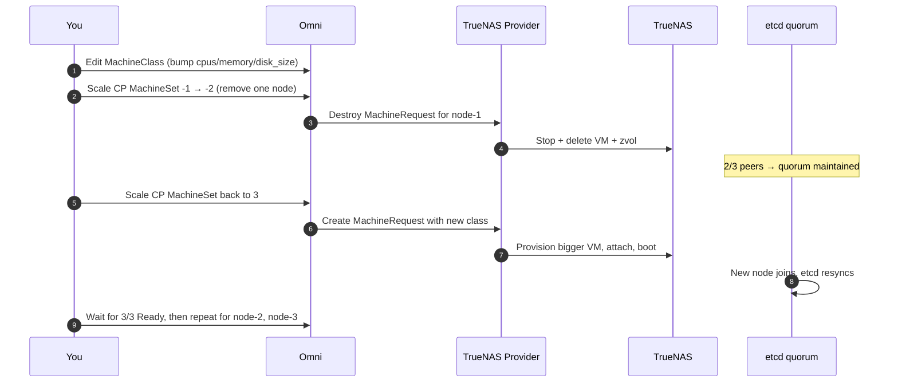

# Sizing Control Plane Nodes

The default MachineClass in [Getting Started](getting-started.md) ships a
**2 vCPU / 2 GiB RAM / 10 GiB disk** control plane. That's fine for a homelab
with a handful of workloads. It is **not** fine once the cluster starts doing
real work.

This page covers:

- [Why control planes run out of room](#what-makes-a-control-plane-bigger)
- [Observable triggers — how to tell *right now* that yours is too small](#triggers-scale-up-when)
- [Sizing table by cluster scale](#sizing-table)
- [How to actually resize a Talos control plane safely](#how-to-resize)
- [HDD-backed pools — tune the cluster, not just the hardware](#hdd-backed-pools--tune-the-cluster-not-just-the-hardware)

!!! tip "TL;DR"
    Scale up the control plane when the apiserver is slow, etcd is warning
    about slow disk, or the CP VM is OOMKilling. Everything else is
    premature optimization.

## What Makes a Control Plane Bigger

Four things drive control plane resource consumption. Knowing which one is
hurting you tells you *what* to bump — CPU, RAM, disk, or all three.

| Driver | Hits | Bump |
|---|---|---|
| **Cluster size (node count)** | etcd heartbeat volume, apiserver watch fan-out | CPU + RAM |
| **Pod / object count** | etcd DB size, apiserver list/watch memory | RAM + disk |
| **API churn** (CI/CD, GitOps, operators) | apiserver CPU, etcd write IOPS | CPU |
| **CRD / operator load** (Argo, Rancher, Crossplane, cert-manager) | etcd objects, controller-manager CPU | CPU + RAM |

A 3-node cluster running a static app looks nothing like a 3-node cluster
running ArgoCD + Prometheus + cert-manager + 40 CRDs. The node count is the
same; the second one needs a bigger control plane.

## Triggers — Scale Up When

Don't guess. Watch for one of these concrete signals.

### 1. `kubectl top` shows CP pressure

```bash
kubectl top node -l node-role.kubernetes.io/control-plane=
```

- **CPU consistently > 70%** under normal load → bump `cpus`.
- **Memory consistently > 70%** or creeping upward over days → bump `memory`.

One spike during an operator reconcile storm is fine. A sustained floor is not.

### 2. kube-apiserver p99 latency is high

From an in-cluster Prometheus or the Omni dashboard:

```promql
histogram_quantile(0.99,
  sum by (le, resource, verb) (
    rate(apiserver_request_duration_seconds_bucket{verb!="WATCH"}[5m])
  )
)
```

- **p99 > 1s on `GET` / `LIST`** for common resources (pods, configmaps) →
  apiserver is CPU-starved or etcd is slow. Bump CPU first, then look at
  etcd disk.

### 3. etcd is warning about slow writes

Check etcd logs on the control plane via Omni:

```bash
omnictl --cluster <name> talosctl logs etcd | grep -iE "took too long|slow"
```

Signals:

- **`apply request took too long`** (> 100 ms) → etcd disk fsync is slow. Root
  cause is usually the ZFS pool, not CPU. See [ZFS considerations](#zfs-and-etcd-disk-performance)
  below. Bumping CP CPU/RAM will *not* fix this. If the pool is HDD and you
  can't add an SLOG, also apply the
  [HDD timeout patch](#hdd-backed-pools--tune-the-cluster-not-just-the-hardware)
  so normal HDD latency stops looking like a failure to Kubernetes.
- **`slow fdatasync`** → same story. The zvol needs a faster vdev layout.
- **`request stats`** showing leader changes / elections during normal
  operation → CP CPU contention. Bump `cpus`.

### 4. kube-apiserver is OOMKilling

```bash
omnictl --cluster <name> talosctl dmesg | grep -i oom
# or
kubectl describe pod -n kube-system kube-apiserver-<node> | grep -i killed
```

**Bump `memory` immediately.** apiserver OOM kills cause cluster-wide API
outages while kubelet restarts it. If you hit this once, double the memory
and move on.

### 5. etcd DB is filling up

```bash
# Via Omni talosctl:
omnictl --cluster <name> talosctl -n <cp-node> \
  service etcd status
```

Or from a control plane node (via Omni shell):

```bash
etcdctl --endpoints=https://127.0.0.1:2379 \
  --cert=/system/secrets/kubernetes/etcd/peer.crt \
  --key=/system/secrets/kubernetes/etcd/peer.key \
  --cacert=/system/secrets/kubernetes/etcd/ca.crt \
  endpoint status -w table
```

- **DB size > 2 GiB** → bump `memory` to 8 GiB+. etcd keeps the working set
  in RAM.
- **DB size approaching `disk_size - 20 GiB`** → bump `disk_size`. etcd
  enforces a 2 GiB default quota unless you raised it, but Talos system
  disk also stores logs, images, and workload ephemeral storage.

### 6. Adding a heavy operator

Installing one of these is a deliberate "bump first, install second" moment:

- **Argo CD / Argo Workflows** — frequent reconciles, many `Application` CRs.
- **Rancher / Fleet** — continuous cluster-wide watches.
- **Crossplane** — many providers, each adds CRDs and controllers.
- **Prometheus Operator** at full mesh-monitoring scale.
- **Istio / Linkerd / Cilium with many `CiliumNetworkPolicy` objects**.

Don't wait for the pain. Double the control plane size *before* installing,
measure, then dial back if you over-shot.

## Sizing Table

These are starting points, not hard rules. Calibrate against the triggers above.

| Scenario | Nodes | Pods (approx) | vCPU | RAM | Disk |
|---|---|---|---|---|---|
| **Homelab — single CP, static workloads** | 1–3 | < 50 | 2 | 2 GiB | 20 GiB |
| **Small prod — 1 or 3 CP, light apps** | 3–10 | < 200 | 2–4 | 4–8 GiB | 40 GiB |
| **Medium — 3 CP, operators, CI/CD** | 10–25 | < 500 | 4 | 8–16 GiB | 80 GiB |
| **Large — 3 CP, GitOps + service mesh** | 25–50 | < 1500 | 4–8 | 16–24 GiB | 100 GiB |
| **Big — dedicated platform team** | 50+ | 1500+ | 8+ | 24+ GiB | 200 GiB+ |

> **Crossplane changes the floor.** The `2 vCPU / 2 GiB` "Homelab" row is for
> a *raw* Kubernetes cluster — no Crossplane, no service mesh, no heavy
> operators. **If you run Crossplane on a single-CP cluster, the floor is
> `4 vCPU / 16 GiB` per CP node**, even at homelab scale. For HA (3 CP)
> with Crossplane, `4 vCPU / 8 GiB` per replica is the floor — the load
> spreads across replicas, but the working set still grows over days.
> Each Crossplane provider installs its own controller plus a CRD set the
> apiserver has to keep in cache, and the work piles onto the same
> control-plane RAM that already holds etcd's working set. The numbers
> below the 16 GiB single-CP floor boot fine and look healthy for days,
> then brown out: apiserver and etcd working sets grow, `MemAvailable`
> drops, Talos's userspace OOM controller starts reaping best-effort
> cgroups (kube-proxy is usually the visible victim), reclaim stalls blow
> etcd's fsync budget, and scheduler / controller-manager flap because
> they can't sync caches or hold leases. There is no swap backstop on
> Talos — once you're past the floor, RAM is the only lever. Other
> operators in the same bucket: Rancher/Fleet, Argo CD with many
> ApplicationSets, Prometheus Operator at full mesh-monitoring scale,
> Cilium with policy-heavy CRDs.

### Why the root disk has a 20 GiB minimum

The provider enforces `disk_size >= 20` at validation time, and the JSON
schema reflects the same floor. It's not arbitrary — it's the smallest
number where a Talos control-plane node reliably survives its first boot.

During cluster bootstrap the kubelet pulls and stores, on the **root
disk**, every control-plane image:

| Image family | Approx pulled size |
|---|---|
| `kube-apiserver` | ~120 MiB |
| `kube-controller-manager` | ~110 MiB |
| `kube-scheduler` | ~60 MiB |
| `etcd` | ~150 MiB |
| `kube-proxy` | ~90 MiB |
| CNI (flannel / cilium / calico) | ~80–300 MiB |
| CoreDNS | ~70 MiB |
| Talos system extensions (qemu-ga, iscsi-tools, util-linux-tools) | ~40 MiB each |

Add the Talos squashfs system image (~300 MiB), its ephemeral partition
overhead, working copies kept for rollback, container log ringbuffers,
and the kubelet's own garbage-collection headroom (10% default) and
**the steady-state consumption on a freshly-installed CP node is
~4–5 GiB of the root disk**. A 5 GiB root disk runs out during the
first pull storm; a 10 GiB root disk survives install but enters
`DiskPressure` the first time kube-apiserver or etcd rolls a new
image version.

**Observed failure mode when this was 5 GiB** (the v0.14 default for
additional disks, accidentally applied to the root): control-plane
nodes entered a loop of *pull image → no space left on device →
kubelet image GC → evict an image we need → re-pull*, and etcd never
came up because its image got evicted mid-write.

20 GiB leaves enough headroom that a production-scale CP can absorb a
Kubernetes minor upgrade (old + new image coexist during the
rollover) without tripping DiskPressure. For the small-prod sizing
tier and above the default of 40 GiB is recommended; 20 is the **do
not go below** line.

Workers technically have lower image pressure (no etcd, often smaller
CNI set), but the floor is applied uniformly — a 20 GiB zvol costs
nothing on any TrueNAS pool we ship against, and one root-disk
minimum across roles makes the validation message operators read when
it fires actually actionable.

`storage_disk_size` and `additional_disks[].size` keep the **5 GiB**
minimum — sidecar / data disks don't carry image pressure.

**Rules of thumb worth knowing:**

- **HA CP = odd number (1, 3, 5).** 3 is the standard. 5 only if you expect
  simultaneous failures. etcd writes are synchronous to a majority — more
  peers means *more* write latency, not less.
- **All CP nodes in a cluster should be the same size.** etcd assumes peers
  are symmetric. Mixing a 4 GiB and a 16 GiB CP means the 4 GiB one becomes
  the bottleneck.
- **Memory > CPU, usually.** Running out of memory OOMs apiserver. Running
  out of CPU just makes things slow. Budget for memory first.
- **`memory` is a hard reservation by default.** TrueNAS locks the full
  `memory` value at `vm.start`. If the host can't guarantee it, the VM
  fails with ENOMEM and provisioning stalls. On tight homelab hosts where
  multiple VMs would otherwise oversubscribe RAM, set `min_memory` (≥ 1024
  MiB, ≤ `memory`) to enable virtio-balloon: the VM starts with
  `min_memory` reserved and grows toward `memory` as host RAM is
  available. **Caveat:** Talos doesn't auto-load `virtio-balloon`, so
  unless you enable it in-guest the VM runs at `min_memory` and `memory`
  becomes a ceiling that's never reached. Size `min_memory` to what Talos
  actually needs (1–2 GiB workers, 2–4 GiB CPs). See
  [Troubleshooting § Host out of memory](troubleshooting.md#vm-creation-succeeds-but-vm-wont-start-host-out-of-memory).

## How to Resize

Talos Linux is **immutable and replaceable**, not mutable. The canonical way
to "resize" a control plane is to *replace* the nodes — the VM provider treats
this as normal lifecycle. etcd quorum survives single-node replacements in a
3-node HA CP.

### Option A — Edit the MachineClass and roll nodes (HA, 3+ CP)

This is the safe path if you have an HA control plane.



1. Edit the MachineClass in Omni (UI or `omnictl apply`) — bump `cpus`,
   `memory`, `disk_size`.
2. In the Omni UI: cordon and drain one CP node, then delete it from the
   MachineSet. The provider destroys its VM and zvol.
3. Scale the MachineSet back up by 1. The provider provisions a new VM at
   the new size. It joins etcd and resyncs.
4. Wait for all 3 CP nodes to report Ready. **This can take a few minutes
   per node** while etcd resyncs.
5. Repeat for the remaining two nodes, one at a time.

**Never delete more than one CP node at a time.** Losing 2 of 3 means losing
quorum; the cluster goes read-only until a peer is restored.

### Option B — Single CP with downtime (homelab)

If you only have one control plane, there is no quorum to preserve — you're
going to have downtime regardless. Two paths:

**B1. Replace via Omni (recommended)** — same flow as Option A, but the
cluster API is unavailable while the new CP provisions (typically 2–5
minutes).

**B2. In-place on TrueNAS (fast but ZFS-only expansion)** — works for bumping
CPU and memory; disk growth needs Talos cooperation:

```bash
# Stop the VM on TrueNAS
midclt call vm.stop <VM_ID>

# Bump CPU and memory (immediate, no Talos change needed)
midclt call vm.update <VM_ID> '{"vcpus": 4, "memory": 8192}'

# To grow the root disk: expand the zvol, then Talos auto-extends the partition
zfs set volsize=40G <pool>/omni-vms/<request-id>

# Start the VM
midclt call vm.start <VM_ID>
```

Disk *shrinking* is never supported. Only grow.

In-place edits bypass Omni's record of intended size. Next provisioner
reconcile won't "fix" it (the provider doesn't reshape existing VMs), but
if Omni ever reprovisions that VM — through a Talos upgrade failure,
healthcheck reset, or manual destroy — you'll get back the MachineClass-sized
VM. Prefer Option B1 unless you're sure.

### ZFS and etcd Disk Performance

etcd is the single most latency-sensitive component in Kubernetes. It does
synchronous `fdatasync` on every write.

If `etcd slow fsync` warnings are your trigger, **bumping vCPU / RAM will
not help.** You need a faster storage path:

- **Add an SLOG / ZIL vdev** to the pool backing CP zvols. A small NVMe SSD
  as SLOG turns ZFS's sync writes from "wait for the spinning disk" into
  "wait for the NVMe". This is the highest-impact single change.
- **Move the CP zvols onto an all-NVMe pool.** If your main pool is HDDs
  with no SLOG, consider creating a small NVMe pool just for control plane
  and etcd-heavy workloads, and pointing the CP MachineClass at that pool
  via its `pool` field.
- **Disable `sync=disabled` for the CP zvol.** *Don't.* etcd relies on
  durable writes; disabling sync risks corrupted cluster state on power
  loss.

See [Storage Guide](storage.md) for pool layout trade-offs.

### HDD-Backed Pools — Tune the Cluster, Not Just the Hardware

If your CP zvols *must* live on a spinning-disk pool with no SLOG (homelab
constraint, no spare NVMe slot, budget reality), the fix is twofold:

1. **First, accept the trade-off.** etcd is happiest on storage with **sub-10 ms
   fsync**. HDDs under load routinely see **50–200 ms**. You will not make an
   HDD as fast as an SSD with config — you can only stop the cluster from
   *interpreting normal HDD latency as failure*.
2. **Then, raise every Kubernetes timeout that assumes SSD-class fsync.** The
   defaults assume etcd commits in <10 ms. A 5x bump on the heartbeat,
   election, and node-monitor timers buys enough headroom that a stalled
   write doesn't trigger leader churn or false `NodeNotReady` flaps.

Apply the patch below as a ConfigPatch in Omni (UI → Cluster → Patches, or
via `omnictl apply`). Replace `talos-home` with your cluster name.

```yaml
metadata:
  namespace: default
  type: ConfigPatches.omni.sidero.dev
  id: 400-apiserver-tuning-talos-home
  labels:
    omni.sidero.dev/cluster: talos-home
spec:
  data: |
    cluster:
      apiServer:
        extraArgs:
          max-requests-inflight: "1500"
          max-mutating-requests-inflight: "700"
          watch-cache-sizes: "compositeresourcedefinitions.apiextensions.crossplane.io#500,releases.helm.crossplane.io#500"
          request-timeout: "2m0s"
        resources:
          requests:
            cpu: 200m
            memory: 512Mi
          limits:
            memory: 1500Mi
      controllerManager:
        extraArgs:
          kube-api-qps: "50"
          kube-api-burst: "75"
          leader-elect-lease-duration: 60s
          leader-elect-renew-deadline: 40s
          leader-elect-retry-period: 5s
          node-monitor-grace-period: 60s
          node-monitor-period: 5s
        resources:
          requests:
            cpu: 100m
            memory: 192Mi
          limits:
            memory: 512Mi
      scheduler:
        extraArgs:
          kube-api-qps: "50"
          kube-api-burst: "75"
          leader-elect-lease-duration: 60s
          leader-elect-renew-deadline: 40s
          leader-elect-retry-period: 5s
        resources:
          requests:
            cpu: 50m
            memory: 96Mi
          limits:
            memory: 256Mi
      # etcd tuning for HDD-backed storage. Defaults assume <10ms fsync;
      # HDDs commonly see 50-200ms under load. 5x timeouts buy headroom.
      etcd:
        extraArgs:
          heartbeat-interval: "500"
          election-timeout: "5000"
          auto-compaction-mode: periodic
          auto-compaction-retention: "1h"
          quota-backend-bytes: "8589934592"
          snapshot-count: "100000"
    machine:
      kubelet:
        extraArgs:
          # Default 10s. Each tick is one apiserver write per node = one
          # etcd fsync. 30s cuts background etcd load 3x.
          node-status-update-frequency: 30s
```

**What each block buys you on HDDs:**

| Knob | Default | HDD value | Why |
|---|---|---|---|
| `etcd.heartbeat-interval` | 100 ms | **500 ms** | Heartbeats fsync. Slower fsync → fewer heartbeats per second so the leader doesn't fall behind its own log. |
| `etcd.election-timeout` | 1000 ms | **5000 ms** | Must be ≥10× heartbeat. Stops a slow fsync from looking like a dead leader and triggering re-election storms. |
| `etcd.auto-compaction-*` | off | **periodic / 1h** | HDD random I/O for compaction is brutal; hourly periodic compaction is cheaper than letting the DB grow unbounded. |
| `etcd.quota-backend-bytes` | 2 GiB | **8 GiB** | Compaction is slower on HDD; give the DB more headroom between compactions. |
| `etcd.snapshot-count` | 10,000 | **100,000** | Snapshots are sync-heavy. Less frequent = less etcd disk thrash. |
| `controllerManager.node-monitor-grace-period` | 40s | **60s** | Stops false `NodeNotReady` flaps when an apiserver write to update node status sits behind a slow etcd commit. |
| `kubelet.node-status-update-frequency` | 10s | **30s** | Each tick is one apiserver write per node — i.e. one etcd fsync. 3× fewer ticks = 3× less background etcd load on a slow disk. |
| `apiServer.max-requests-inflight` | 400/200 | **1500/700** | More CRDs (Crossplane, Argo) → more bursty list/watch traffic. Raises ceiling so the apiserver queues instead of 429-ing controllers. |
| `*.kube-api-qps` / `kube-api-burst` | 20/30 | **50/75** | Controllers can saturate the apiserver with default QPS once you have ≥20 CRDs. Raise so reconcile loops aren't client-side throttled. |
| `*.leader-elect-*` | 15s/10s/2s | **60s/40s/5s** | Same logic as etcd election: don't interpret a slow-fsync hiccup as a dead leader. |

**Confirm before you keep the patch.** After applying, watch:

```bash
omnictl --cluster <name> talosctl logs etcd | grep -iE "took too long|slow|elect"
```

`apply request took too long` warnings should drop sharply. If you still see
`leader changed` or `lost the TCP streaming connection` regularly, the disk
is too slow even with these timeouts — get an SLOG NVMe or move CP zvols to
a flash pool. There is no software fix below that floor.

> **`watch-cache-sizes` is example-only.** The values shown
> (`compositeresourcedefinitions...crossplane`, `releases.helm.crossplane.io`)
> are tuned for a Crossplane-heavy cluster. Drop or replace them for your
> workload — wrong resource names are silently ignored, but a cache sized for
> resources you don't have just wastes apiserver RAM.

## See Also

- [Getting Started](getting-started.md) — initial sizing for first clusters
- [Quick Start](quickstart.md) — MachineClass field reference
- [Storage Guide](storage.md) — pool / SLOG / NVMe considerations
- [Troubleshooting](troubleshooting.md) — when sizing isn't the fix
